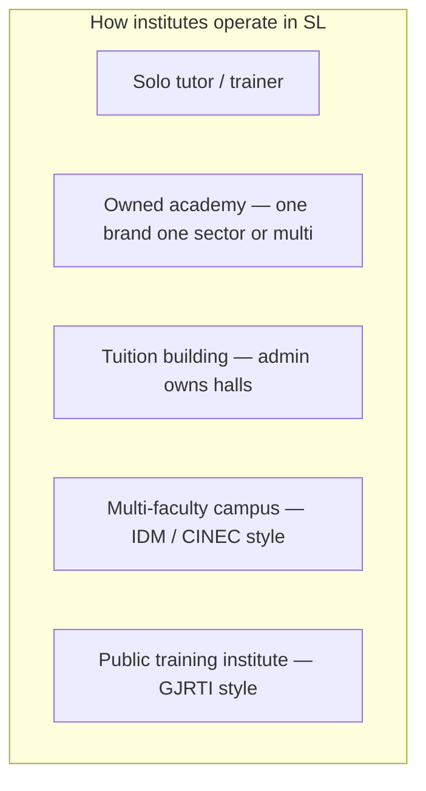

# Sri Lanka Education & Training Market — ClassFlow Sector Model

How academies and institutes **actually** work in Sri Lanka — beyond school tuition.

**Last updated:** June 2026  
**Companion:** [SL_TUITION_OPERATING_MODEL.md](./SL_TUITION_OPERATING_MODEL.md) (money flows + building rental)

---

## 1. One country, many academy types

ClassFlow originally assumed **school exam tuition** (O/L, A/L). That is only **one vertical** in a much larger market.

| Sector | Real examples in SL | Typical learner | How courses are named |
|--------|---------------------|-----------------|------------------------|
| **School tuition** | Shakthi, Ranjan, Nugegoda towers | School students | A/L Combined Maths — Theory |
| **IT & technology** | iCET, SJIIT, IDM ICT faculty | School leavers, career switchers | Diploma in Software Engineering |
| **Maritime** | MSTI, CINEC maritime | Cadets, ratings, officers | STCW Basic Safety, OOW Prep |
| **Gemology & jewellery** | GJRTI, GASL, private gem schools | Traders, cutters, designers | Diploma in Professional Gemmology |
| **Psychology & counselling** | CIRP, RIPC, IMH | Practitioners, HR, teachers | NVQ 5 Diploma in Counselling |
| **Business & management** | IDM, NIBM, private colleges | Professionals, entrepreneurs | HND Business Management |
| **Language** | British Council partners, Japanese/Korean schools | Students, migrants, corporate | IELTS Prep, JLPT N4 |
| **Hospitality & tourism** | CINEC hospitality, chef schools | Hotel staff, culinary students | Certificate in Food Production |
| **Health sciences** | Nursing schools, pharmacy assistant | Healthcare trainees | Nursing Aide NVQ 4 |
| **Aviation** | Cabin crew, AME institutes | Airline aspirants | Cabin Crew Initial, AME Module |
| **Creative & media** | Fashion, photography, multimedia | Designers, content creators | Diploma in Fashion Design |
| **Vocational / NVQ** | TVEC centres, DTET partners | Trades, technicians | NVQ Level 4 Electrician |
| **Corporate / short** | In-house training, workshops | Employees | Leadership Workshop (2 days) |

**IDM (25+ branches)** and **CINEC** are **multi-faculty campuses** — one institute runs many sectors under one brand.

---

## 2. Course naming differs by sector

Do **not** force every academy through "Grade 11 + Subject".

### School tuition track
```
Exam level + Subject + Session type
→ A/L Combined Maths — Theory
```

### Professional / vocational track
```
Qualification level + Programme name + Module (optional)
→ Diploma in Software Engineering — Year 1
→ NVQ Level 4 — Gem Cutting & Polishing
→ Certificate in Counselling Skills — Module 2
```

### Maritime track
```
STCW / rank + Course name + Intake
→ Officer of the Watch — Deck Prep (2026 Intake)
→ STCW Basic Safety Training — Short course
```

### Qualification levels used in SL market

| Level | Used by | Examples |
|-------|---------|----------|
| **Certificate** | Short skills, entry | Certificate in Web Design |
| **Foundation** | Pathway to diploma | Foundation in IT |
| **Diploma** | 1–2 year vocational | Diploma in Gemmology |
| **Higher Diploma / HND** | Advanced vocational | HND Software Engineering |
| **Professional diploma** | Industry body | DGem(SL), professional counselling |
| **NVQ L3–L7** | TVEC-accredited trades | NVQ 5 Jewellery Manufacturing |
| **Module / unit** | Part of larger programme | Counselling Psychology — Part 1 |
| **Short course / workshop** | Days to weeks | STCW, first aid, seminar |
| **Intake / batch** | Cohort identifier | 2026 January Intake |

---

## 3. Organizational models (who runs the building)

Same **sectors**, different **business structures**:



| Model | Who pays student fees | Who pays building/hall | Example |
|-------|----------------------|------------------------|---------|
| **Solo tutor** | Teacher | Own room or none | Home maths teacher |
| **Owned academy** | Academy cashier | Academy owner | Gemology school, IT academy |
| **Tuition building** | Each visiting teacher | Teachers → building admin | Nugegoda class tower |
| **Multi-faculty campus** | Central finance per faculty | Campus owns all halls | IDM branch, CINEC |
| **Franchise branch** | Branch collects, HQ policy | Franchise fee to HQ | IDM provincial branch |

### Building rental model (still valid for school tuition towers)

- Admin provides **halls + timetable board**
- **Visiting teachers** rent slots, own students, collect tuition
- Common in Colombo suburbs for **O/L and A/L** only

### Owned professional academy (different from tuition tower)

- **Marine academy** (MSTI): owns simulators, docks, classrooms — students pay **the academy**
- **IT institute** (iCET): owns labs — students pay **the institute**
- **Counselling institute** (RIPC): owns clinical training — students pay **the institute**
- **No visiting-teacher rent model** — but may still have **multiple lecturers** on payroll

---

## 4. Money flows by sector

| Sector | Typical fee structure | Admission? | Installments? | Certificate |
|--------|----------------------|------------|---------------|-------------|
| School tuition | Monthly per class | Common (LKR 1k–5k) | Monthly | Term completion |
| IT / diploma | Per programme or per month | Common | Per semester | Diploma on completion |
| Maritime | Per course + intake | High | Per module | STCW / competency certs |
| Gemology | Per diploma year | Moderate | Per term | DGem(SL), NVQ |
| Counselling | Per programme | Moderate | Per part (Part 1 / 2) | NVQ 5, professional diploma |
| Short workshop | One-time | Rare | Single payment | Attendance cert |

ClassFlow fee engine should support:
- **Monthly** (tuition class)
- **Programme lump sum** (diploma intake)
- **Per-module** (counselling Part 1 / Part 2)
- **One-time** (STCW short course)
- **Hall rent** (teacher → building admin only)

---

## 5. ClassFlow product mapping

### Workspace setup (onboarding)

1. **Operating model:** Solo | Owned academy | Tuition building | Multi-faculty campus
2. **Primary sector:** School tuition | IT | Maritime | Gemology | … (multi-select for campus)
3. **Course catalog style:** Auto-configured from sector

### Sector → UI behaviour

| Sector | Create course shows | Student profile needs | Certificate style |
|--------|--------------------|-----------------------|-----------------|
| School tuition | Exam level + session type | School grade helpful | Term completion |
| IT / business | Programme + intake | NIC, entry qual | Diploma |
| Maritime | Rank + STCW + intake | Medical cert flag | Competency / attendance |
| Gemology | NVQ level + module | Entry qual (A/L or experience) | Professional diploma |
| Counselling | Part/module + NVQ level | Background check flag | Clinical hours + diploma |
| Language | Level (IELTS/JLPT) + batch | Target exam date | Level achieved |

### Schema direction (Sprint 8+)

```sql
alter table workspaces add column academy_sector text;
alter table workspaces add column operating_model text;
  -- solo | owned_academy | tuition_building | multi_faculty_campus

alter table classes add column sector text;
alter table classes add column qualification_level text;
  -- certificate | diploma | nvq | module | short_course | school_session
alter table classes add column programme_name text;
alter table classes add column intake_label text;  -- 2026 Jan Intake
alter table classes add column delivery_mode text; -- classroom | lab | simulator | hybrid | online
```

---

## 6. Competitive landscape (why sectors matter)

| Player type | SL examples | ClassFlow opportunity |
|-------------|-------------|-------------------------|
| School tuition only apps | Local fee books, Excel | Already strong |
| University ERP | Too heavy for small academies | Wrong fit |
| Generic LMS | Moodle-based | No cash fees, no parent WhatsApp |
| **Vertical academies** | Maritime, gem, IT, counselling | **Underserved** — no SL-specific ops app |

**Positioning:** *The operations app for Sri Lankan academies and institutes — school tuition, IT, maritime, gemology, counselling, and more — with cash fees, attendance, and parent trust built in.*

---

## 7. Pilot demos (updated plan)

| Demo account | Sector | Model | Sample courses |
|--------------|--------|-------|----------------|
| `academy@classflow.lk` | School tuition | Owned academy | A/L Combined Maths Theory + Revision |
| `demo@classflow.lk` | School tuition | Tuition building | Visiting teachers in shared halls |
| `it-academy@classflow.lk` (future) | IT | Owned academy | Diploma Software Engineering |
| `marine@classflow.lk` (future) | Maritime | Training institute | STCW Basic Safety |
| `gem-academy@classflow.lk` (future) | Gemology | Owned academy | Diploma Professional Gemmology |

---

## 8. Sprint roadmap (sector-aware)

| Sprint | Deliverable |
|--------|-------------|
| **Now** | Sector taxonomy in app + course templates per vertical |
| **8** | `sector` + `qualification_level` on classes; sector picker in onboarding |
| **9** | Programme/intake fee models (not only monthly) |
| **10** | Hall rent ledger (tuition building model) |
| **11** | Multi-faculty campus (faculties under one workspace) |
| **12** | Sector-specific certificates (clinical hours, STCW, NVQ) |

See [SL_MARKET_ROADMAP.md](./SL_MARKET_ROADMAP.md).
