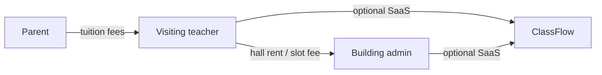

# Sri Lankan Tuition Operating Model — ClassFlow Design

How ClassFlow should reflect **real** tuition centres, academies, and institute buildings in Sri Lanka.

**See also:** [SL_EDUCATION_SECTORS.md](./SL_EDUCATION_SECTORS.md) — full market map (IT, maritime, gemology, counselling, NVQ, and more).

**Last updated:** June 2026

---

## 1. Three real business models (not “grades”)

In Sri Lanka, parents and teachers talk about **courses**, not school grades.

| What parents say | What it means in the app |
|------------------|--------------------------|
| “A/L Combined Maths theory” | Exam level **A/L** + subject + session type **Theory** |
| “O/L Science revision” | Exam level **O/L** + subject + session type **Revision** |
| “A/L Physics paper class” | Exam level **A/L** + subject + session type **Paper** |
| “Grade 5 scholarship class” | Exam level **Grade 5 Scholarship** + subject |

**School grade (6–13)** is useful on the **student profile** (which school year they are in). It is **not** how tuition classes are usually named or marketed.

### Course dimensions (replace “grade” on classes)

```
Course = Exam level + Subject + Session type + Medium
```

| Dimension | Examples |
|-----------|----------|
| **Exam level** | O/L, A/L, Grade 5 Scholarship, London A/L, Other |
| **Subject** | Combined Maths, Physics, Chemistry, ICT, Sinhala, … |
| **Session type** | Theory, Revision, Paper, Mass lecture, Online |
| **Medium** | Sinhala, English, Tamil |

**Display example:** `A/L Combined Maths — Theory (Sinhala)`

---

## 2. Money flows — two separate ledgers

ClassFlow must never mix these:

### A. Tuition money (parent → teacher)

- Parent pays **the teacher** (or teacher’s assistant) in cash.
- Teacher sets their own monthly fee per course.
- ClassFlow records: invoice → payment → receipt → defaulter list.
- **Building admin does not own this money** in the hall-rental model.

### B. Hall / building money (teacher → building admin)

- Building owner provides halls, timetable board, sometimes front desk.
- Each visiting teacher pays **hall rent** or **slot fee** to the admin.
- May be: flat monthly per slot, per-student levy, or % of collection (future).
- ClassFlow records: hall booking → rent invoice → teacher payment to building.

### C. SaaS money (teacher/building → ClassFlow)

- Subscription for using the app (separate product billing).



---

## 3. Workspace types mapped to Sri Lanka

| ClassFlow mode | Real-world example | Who owns the workspace | Who collects student fees | Who manages halls |
|----------------|-------------------|------------------------|---------------------------|-------------------|
| **Solo** | Home tuition / one teacher | The teacher | Same teacher | N/A or own room |
| **Academy** | Branded centre (e.g. “Shakthi Maths”) | Academy owner | Academy / owner | Owner’s halls |
| **Institute (building)** | Multi-teacher building (e.g. “Nugegoda Tower”) | Building admin | **Each teacher** | Building admin |

### Institute building model (your description)

1. **Building admin** creates workspace → adds branches, halls, timetable.
2. **Visiting teachers** are invited as `teacher` role (or future **tenant** role).
3. Each teacher:
   - Creates **their own courses** (A/L Physics theory, etc.)
   - Enrolls **their own students**
   - Collects **their own fees**
   - Books **hall slots** → owes **rent** to admin
4. **Front desk** (optional): register students, stamp attendance, but fees still attributed to teacher.
5. **Admin dashboard**: hall occupancy, teacher rent due, building revenue — **not** student tuition totals (unless teacher opts in).

---

## 4. Product surfaces by mode

### Solo teacher

- Simple: students, courses (optional exam level), attendance, fees, parent WhatsApp.
- Hide: catalog admin, branches, staff, hall rent.

### Owned academy

- One brand, multiple teachers under same fee policy.
- Catalog: programs → batches → theory / revision / paper offerings.
- Admission fee to **academy**, certificates from **academy**.
- Admin may collect all fees (current ClassFlow behaviour).

### Tuition building (institute)

| Surface | Building admin sees | Visiting teacher sees |
|---------|--------------------|-----------------------|
| Home | Hall usage today, rent due | My classes today |
| Students | Search all (optional) | **My students only** |
| Fees | **Hall rent** from teachers | **My tuition** collections |
| Classes | Master timetable / conflicts | **My courses** + hall booking |
| Reports | Rent + occupancy by hall | My attendance + collection |

---

## 5. Data model direction (Sprint 8+)

Current schema uses `classes.subject` + `classes.grade`. Migration path:

### Phase A — UX now (no breaking migration)

- Course **templates** in app (A/L Combined Maths — Theory, etc.).
- `subject` stores full course label; `grade` kept for backward compatibility / reporting only.
- UI shows exam level + session type, hides grade chips for academy/institute.

### Phase B — Schema

```sql
-- Exam level + session type on classes
alter table classes add column exam_level text;
alter table classes add column session_type text;

-- Teacher tenant within building workspace
create table teacher_profiles (
  workspace_id uuid,
  user_id uuid,
  display_name text,
  subjects text[],
  hall_rent_plan text, -- monthly_slot | per_student | custom
  active boolean
);

-- Hall slot booking (teacher rents slot)
create table hall_bookings (
  workspace_id uuid,
  hall_id uuid,
  teacher_user_id uuid,
  weekday text,
  start_time time,
  end_time time,
  monthly_rent_lkr integer,
  active boolean
);

-- Rent invoices (teacher → building)
create table hall_rent_invoices (
  workspace_id uuid,
  teacher_user_id uuid,
  booking_id uuid,
  month text,
  amount integer,
  paid_amount integer,
  status text
);
```

### Phase C — Scoped data per teacher in building mode

- `students.teacher_id` or `students.primary_teacher_id`
- `classes.teacher_id` — who owns this course
- RLS: teachers see only their rows; admin sees all

---

## 6. Beautiful UX principles

1. **Speak like Sri Lankan teachers** — “A/L theory class”, not “Grade 13 Mathematics”.
2. **Show the right money** — tuition tab for teachers, rent tab for building admin.
3. **One timetable, many teachers** — institute home is a hall grid with teacher names in slots.
4. **Don’t force building admin to collect student fees** — optional, not default.
5. **Parent portal unchanged** — parent still sees child + teacher course + fee status per enrollment.

---

## 7. Demo accounts (pilot)

| Demo | Models | Courses seeded |
|------|--------|----------------|
| `academy@classflow.lk` | Owned academy | A/L Combined Maths Theory + Revision |
| `demo@classflow.lk` | Tuition building | Multiple teachers’ courses in shared halls |

---

## 8. Sprint alignment

| Sprint | Focus |
|--------|--------|
| **Now** | Course templates, SL labels in UI, updated onboarding copy |
| **Sprint 8** | `exam_level` + `session_type` columns, teacher-scoped students/classes in institute mode |
| **Sprint 9** | Hall bookings + teacher rent invoices |
| **Sprint 10** | Building admin dashboard (occupancy, rent due, conflict board) |

See [SL_MARKET_ROADMAP.md](./SL_MARKET_ROADMAP.md) for market priorities.
